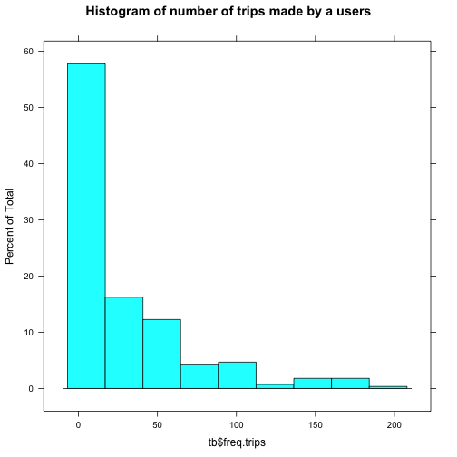
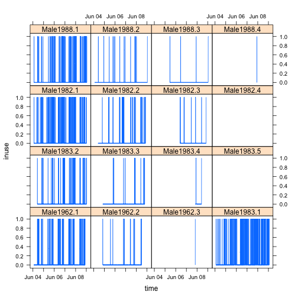
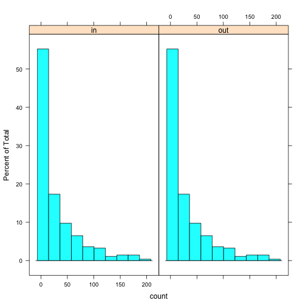
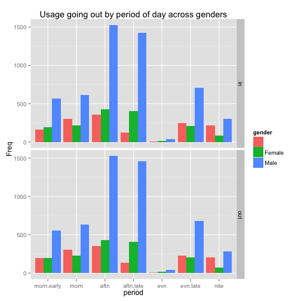
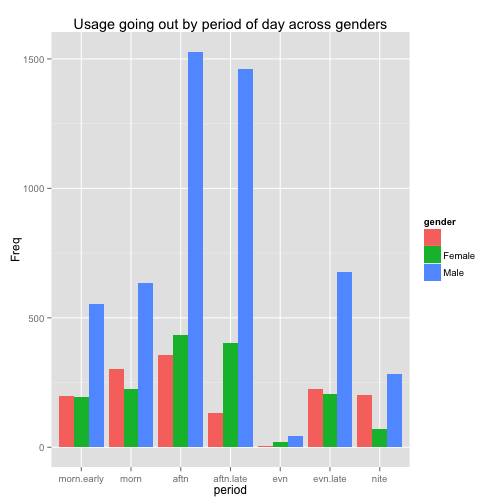
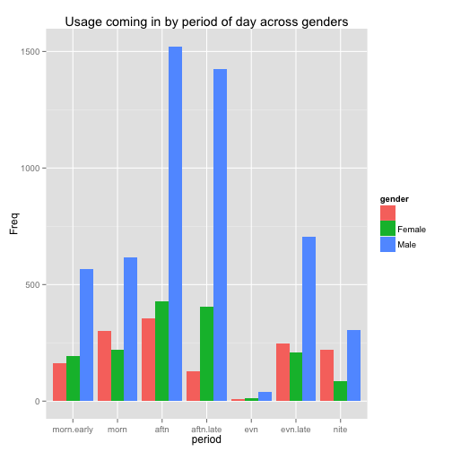
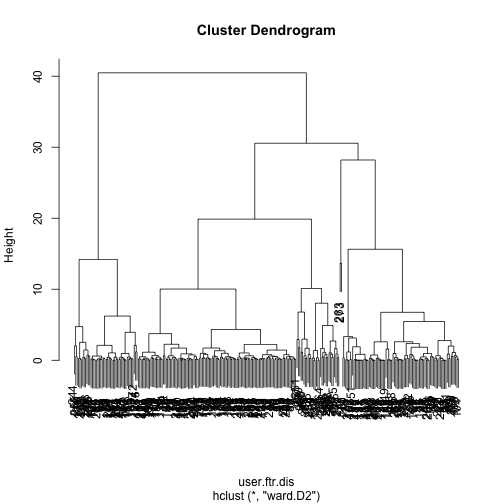
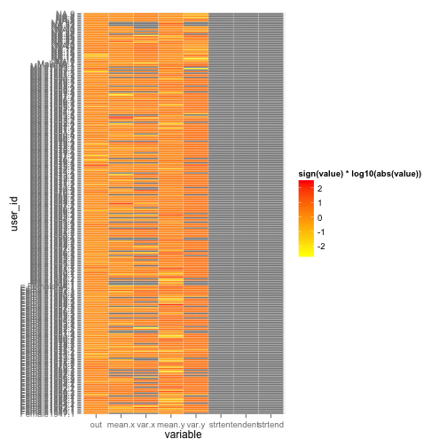

```r
knitr::opts_chunk$set(cache=FALSE)
knitr::opts_chunk$set(echo=TRUE)
prjpath <- "~/work/citiviz/bikeSharing/bikestats/"
datapath <- paste(prjpath, "data/", sep="")
analpath <- paste(prjpath, "analyses/", sep="")
rcodepath <- paste(analpath, "Rcode/", sep="")
setwd(analpath)
```
#Abstract
What does the user think about the bike sharing system they are using. 

#Organization of the files
The variable _datapath_ should point to the location of the data within the project directory, and the variable _analpath_ to the location of the analyzes. The data files are zip files under the sub-directories of _datapath_. 

#Data and Exploratory Analysis

For our examples we will use the hubway data, that we load using our custom function,

```r
source(paste(rcodepath,"datamanip.R", sep=""))
path.zip <- paste(datapath, "hubway/hubway_2011_07_through_2013_11.zip", sep="")
print(paste("we will try to read the file from", path.zip))
```

```
## [1] "we will try to read the file from ~/work/citiviz/bikeSharing/bikestats/data/hubway/hubway_2011_07_through_2013_11.zip"
```

```r
print(paste("see if file exists", file.exists(path.zip))) 
```

```
## [1] "see if file exists TRUE"
```

```r
hubway.orig <- read.csv.zip(name.csv="hubway_trips.csv", 
                            path.csv=paste(datapath, 
					   "hubway/hubway_trips.csv", sep=""),
                            path.zip=path.zip )


hubway <- hubway.orig
hubway.st <- read.csv.zip(name.csv="hubway_stations.csv",
                          path.csv=paste(datapath, 
					 "hubway/hubway_stations.csv", sep=""),
                          path.zip=path.zip)
print("data read with dimensions")
```

```
## [1] "data read with dimensions"
```

```r
print(dim(hubway))
```

```
## [1] 1579025      13
```
The hubway data contains columns,

```r
print(names(hubway))
```

```
##  [1] "seq_id"     "hubway_id"  "status"     "duration"   "start_date"
##  [6] "strt_statn" "end_date"   "end_statn"  "bike_nr"    "subsc_type"
## [11] "zip_code"   "birth_date" "gender"
```
One problem is using different data-sets is the non-uniformity of variable names. We have written a function, _namingScheme_ (see _varNamingScheme.Rmd_) that can provide a dictionary to rename the relevant variables. We illustrate its use in the code below,

```r
source(paste(rcodepath, "varNamingScheme.R", sep=""))
nms.indata <- names(hubway)
nms.touse <- namingScheme(nms.indata,
                          var.user_id = NA,
                          var.start_statn="strt_statn",
                          var.end_statn="end_statn",
                          var.start_time="start_date",
                          var.end_time="end_date",
                          var.bike_id="bike_nr",
                          var.trip_id=NA)
print("we will rename data from")
```

```
## [1] "we will rename data from"
```

```r
print(nms.indata)
```

```
##  [1] "seq_id"     "hubway_id"  "status"     "duration"   "start_date"
##  [6] "strt_statn" "end_date"   "end_statn"  "bike_nr"    "subsc_type"
## [11] "zip_code"   "birth_date" "gender"
```

```r
print("to")
```

```
## [1] "to"
```

```r
print(nms.touse)
```

```
##        seq_id     hubway_id        status      duration    start_date 
##      "seq_id"   "hubway_id"      "status"    "duration"  "start_time" 
##    strt_statn      end_date     end_statn       bike_nr    subsc_type 
## "start_statn"    "end_time"   "end_statn"     "bike_id"  "subsc_type" 
##      zip_code    birth_date        gender 
##    "zip_code"  "birth_date"      "gender"
```

We redefine the dates to be useful datetime classes,

```
## [1] "the names of hubway should have changed to "
```

```
##  [1] "seq_id"      "hubway_id"   "status"      "duration"    "start_time" 
##  [6] "start_statn" "end_time"    "end_statn"   "bike_id"     "subsc_type" 
## [11] "zip_code"    "birth_date"  "gender"
```

The hubway data is large. In order to run our analysis in reasonable time, and also to focus on given time periods we will sample a subset specified by days. As an example for our analysis we will sample one week from June 2012.

```
## [1] "we will extract data from dims"
```

```
## [1] 1579025      13
```

```
## [1] "Number of trips during the week starting on June 04 2012 8155"
```
                                  
We will use this sample data to develop our statistical analyses. After we have trained some models, we can look back at the full data-set.


# Adding features to the data

Biker behavior in the morning can be different from that in the afternoon. We will divide each day into periods,

```
## Warning in if (class(times) != "integer") times <- hour(times): the
## condition has length > 1 and only the first element will be used
```

#Inventing Users
The hubway data does not provide user ids, which limits the analyses for user properties. To make this data more useful we have written some functions to invent users in 
_userDisambigation.Rmd_.


```
## [1] FALSE
```
The test passed. So now we can establish the new user ids,


 
The histogram look reasonable, so we can go ahead and use our disambiguation method to create user ids.

#Transactions
We have written a function to convert trips to transactions (see _datamanip.Rmd_), that we use to convert the trips to transactions in the hubway sample.

The columns in the transactions are,

```
##  [1] "seq_id"      "hubway_id"   "status"      "duration"    "bike_id"    
##  [6] "subsc_type"  "zip_code"    "birth_date"  "gender"      "period"     
## [11] "pre_user_id" "new_user_id" "user_id"     "time"        "statn"      
## [16] "drxn"
```
The column *statn* should provide the location of the bike-station, either directly as (long, lat) or as a label along with a dictionary that can be queried with that label.
From now on we will have two forms for the data, as trips, and as transactions.

```
## Warning in if (class(times) != "integer") times <- hour(times): the
## condition has length > 1 and only the first element will be used
```

We can take a peek at the transactions in our sample week,

```
##        seq_id hubway_id status duration bike_id subsc_type zip_code
## 256959 256959    293864 Closed      322  B00493 Registered   '02215
## 257045 257045    293960 Closed      404  B00164 Registered   '02114
## 257073 257073    293988 Closed      265  B00427 Registered   '02215
## 257111 257111    294031 Closed      460  B00194 Registered   '02116
## 257127 257127    294048 Closed      359  B00008 Registered   '02460
## 257137 257137    294058 Closed      319  B00007 Registered   '02118
##        birth_date gender    period pre_user_id new_user_id    user_id
## 256959       1962   Male nite.late    Male1962  Male1962.1 Male1962.1
## 257045       1962   Male      morn    Male1962  Male1962.1 Male1962.1
## 257073       1962   Male      morn    Male1962  Male1962.1 Male1962.1
## 257111       1962   Male      morn    Male1962  Male1962.1 Male1962.1
## 257127       1962   Male      aftn    Male1962  Male1962.1 Male1962.1
## 257137       1962   Male      aftn    Male1962  Male1962.1 Male1962.1
##                       time statn drxn
## 256959 2012-06-04 02:05:00    36  out
## 257045 2012-06-04 10:01:00    43  out
## 257073 2012-06-04 10:27:00    53  out
## 257111 2012-06-04 11:26:00     4  out
## 257127 2012-06-04 12:11:00     3  out
## 257137 2012-06-04 12:47:00    57  out
```

Transalting transactions to trips is harder, and will be implemented later.

#Statistics for a single user
How often does a user use bikes? At what time of day? Which stations are most frequented by a user? What is the duration of a user's trips? 


Lets explore usage traces of some users,

```
## estimate only: convert periods to intervals for accuracy
## estimate only: convert periods to intervals for accuracy
## estimate only: convert periods to intervals for accuracy
## estimate only: convert periods to intervals for accuracy
## estimate only: convert periods to intervals for accuracy
## estimate only: convert periods to intervals for accuracy
## estimate only: convert periods to intervals for accuracy
## estimate only: convert periods to intervals for accuracy
## estimate only: convert periods to intervals for accuracy
## estimate only: convert periods to intervals for accuracy
## estimate only: convert periods to intervals for accuracy
## estimate only: convert periods to intervals for accuracy
## estimate only: convert periods to intervals for accuracy
## estimate only: convert periods to intervals for accuracy
## estimate only: convert periods to intervals for accuracy
## estimate only: convert periods to intervals for accuracy
```

 

What about the intermittency of use by an individual user? 

#User features

In order to study the users, we extract features from their usage data. The features we will discuss are as follows,
1. Frequency of use
2. Duration of trips
3. Intermittency of use
4. The diversity of start stations
5. The diversity of end stations
6. The diversity of (start, end) station pairs.

To illustrate the features we will use both the trip and transaction forms of the data with disambiguated user ids, as our starting data. 
### Frequency of use
A user's frequency is the number of times they have used the bike-sharing system, or the number of trips they have made. We will assume that a user who rents a bike also returns it in the dataset.


Lets explore user frequencies,
 

## Frequency of use by time of day
We have the variable _period_ that we can use to study the period of the day when the bikes are used. 

```
##  [1] "seq_id"      "hubway_id"   "status"      "duration"    "bike_id"    
##  [6] "subsc_type"  "zip_code"    "birth_date"  "gender"      "period"     
## [11] "pre_user_id" "new_user_id" "user_id"     "time"        "statn"      
## [16] "drxn"
```

   
We see that usage by both males and females follows the same pattern during the day. We can compute the frequency of use across the day for each user,


##Intermittency of use

##Duration of trips
Duration of trips can be easily extracted from *trips*

And now we can use the function to obtain the durations of user's trips,


##Diversity of stations
There aere three diversity values we can define for the stations that a user frequents, start, end and the start-to-end stations of each trip.


### Gathered user features
Ok, now lets put all that we have together,

We can now cluster the users,
  
